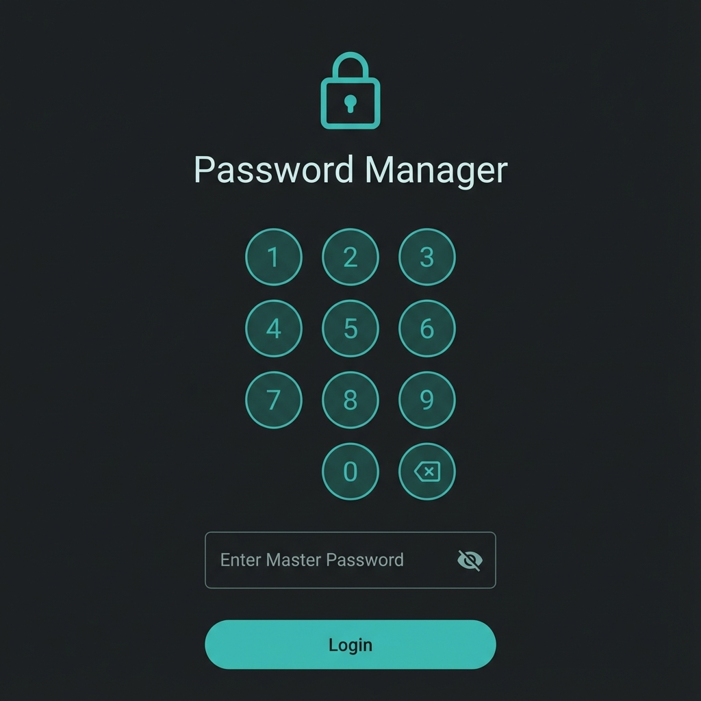
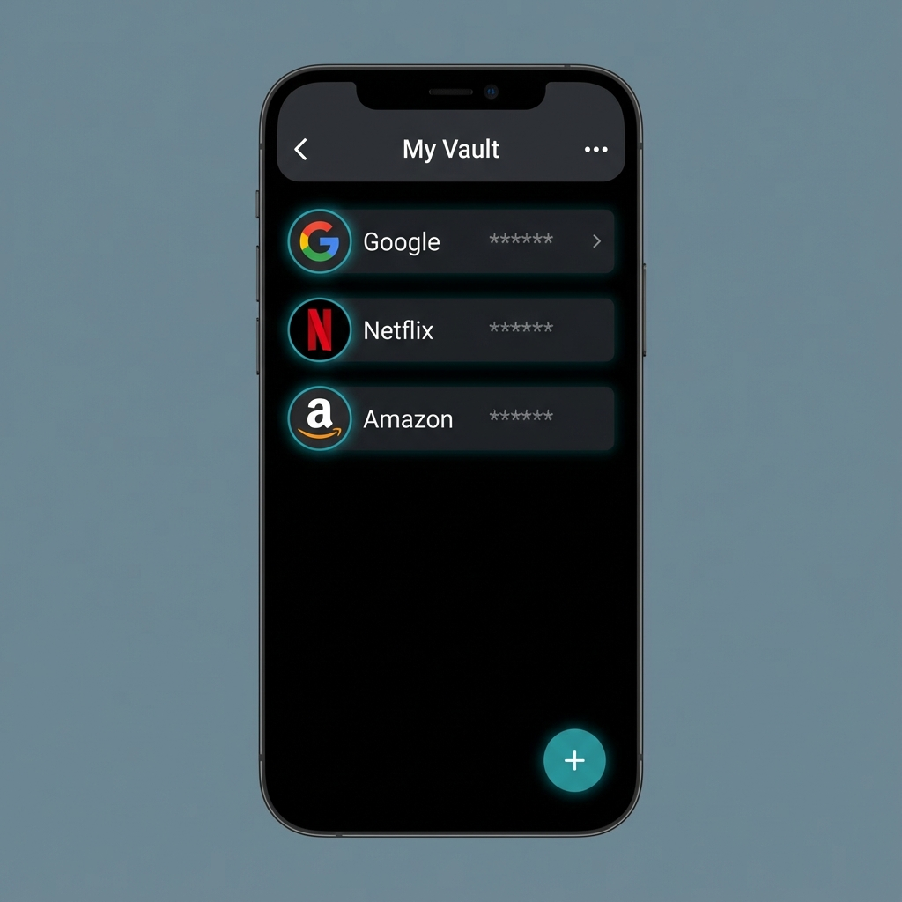

# Password Manager (Android)

A secure, simple, and offline-first password manager application for Android. Built with modern Android development practices, it ensures your credentials are encrypted and stored locally on your device.

## ✨ Features
- **Secure Storage**: Uses Realm Database with strong encryption to store your credentials.
- **Offline First**: Your data never leaves your device unless you explicitly export it.
- **App Dashboard**: Organize and manage your accounts in a clean list view.
- **Backup & Export**: Securely export your vault to an encrypted file for backup or verified web viewing.

---

## 📥 Download & Install
You can download the latest APK from the **Releases** section of this repository.

[**➡️ Download Latest APK**](https://github.com/AndroPlus/password-manager/releases)

### Installation Steps:
1.  Download the `.apk` file to your Android device.
2.  Tap on the downloaded file to install.
3.  If prompted, allow installation from "Unknown Sources" (since this is a developer build).
4.  Open the app and set up your master password.

---

## 📱 App Walkthrough

### 1. Secure Login
Upon launching the app, you are greeted with a secure login screen. You must enter your Master Password or PIN to decrypt your vault.
*(Note: Your master password is the key to your data. Do not lose it!)*



### 2. My Vault (Dashboard)
Once unlocked, you will see your "Vault" - a list of all your stored accounts.
- **Add Account**: Tap the **+** (Plus) button at the bottom right.
- **View Details**: Tap any item to view the username and password.
- **Edit/Delete**: Long-press an item to see more options.



### 3. Adding Credentials
When adding a new account, you can:
- Enter the **App Name** (e.g., Netflix, Google).
- Input your **Username/Email**.
- Enter or **Generate** a strong password.
- Save to encrypt and store it in the database.

### 4. Settings & Export
Navigate to Settings to:
- **Change Master Password**: Update your main entry key.
- **Export Data**: Create an encrypted backup (`.enc` file). This file can be imported into our [Web Viewer](https://github.com/AndroPlus/password-manager-web) for access on a PC.

---

## 🛠️ How to Build from Source

1.  **Prerequisites**:
    *   Android Studio (Ladybug or newer)
    *   JDK 17
    *   Android SDK 35 (Android 15)

2.  **Clone the Repository**:
    ```bash
    git clone https://github.com/AndroPlus/password-manager.git
    ```

3.  **Open in Android Studio**:
    *   Select "Open" and choose the cloned directory.
    *   Wait for Gradle Sync to complete.

4.  **Run**:
    *   Connect your device via USB or start an Emulator.
    *   Click the green **Run** button.

---

## ❤️ Support
If you find this project useful, please give it a star on GitHub!
